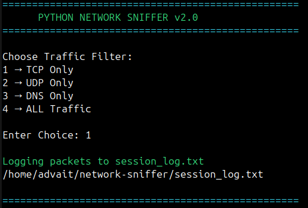
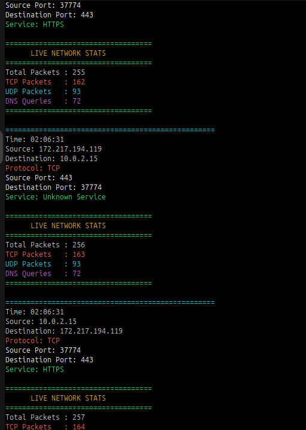
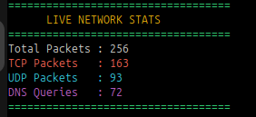
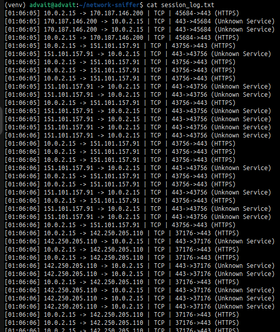
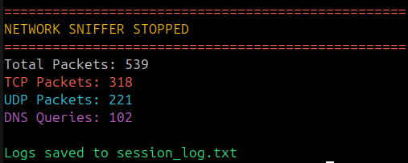

# Python Network Sniffer v2.0

Python-based network sniffer built using Scapy featuring live packet analysis, DNS monitoring, traffic filtering, logging, dashboards and multithreaded packet processing.
---

## 🚀 Features

- Live Packet Capture
- TCP / UDP / DNS Traffic Detection
- DNS Query Monitoring
- Service Identification
- Traffic Filters
- Packet Counters
- Live Dashboard
- Export Session Logs
- Colorized Terminal Output
- Graceful Shutdown Statistics
- Multithreaded Packet Processing using Queue + Worker Threads

---

## 🧠 Concepts Used

- Packet Sniffing
- Networking Fundamentals
- TCP/IP Protocols
- DNS Analysis
- Protocol Identification
- Packet Filtering
- Threading
- Queue Data Structures
- Logging
- Python Exception Handling

---

## 🆕 New in v2.0

- Traffic filtering options
- Session log export
- Neon colorized output
- Live dashboard statistics
- Queue-based architecture
- Worker thread packet processing
- Cleaner GitHub project structure

---

## 📸 Screenshots

### Startup + Traffic Filter



---

### Colorized Packet Output



---

### Live Dashboard



---

### Session Log Export



---

### Graceful Shutdown Summary



---

## ⚙️ How It Works

1. User launches sniffer
2. Selects traffic filter
3. Scapy captures packets
4. Captured packets enter Queue
5. Worker thread processes packets
6. Protocols and services identified
7. DNS queries extracted
8. Dashboard updates live
9. Session logs exported automatically

---

## 🛠 Tech Stack

- Python
- Scapy
- Colorama
- Threading
- Queue

---

## ▶ Usage

Install requirements:

```bash
pip install -r requirements.txt

Run:
sudo python3 sniffer.py

⚠ Limitations
Requires root privileges
Interface name may vary
DNS visibility depends on traffic
HTTPS contents remain encrypted
Terminal based UI only


⚠ Ethical Note

Use only on systems and networks you own or have permission to monitor.


👨‍💻 Author
Advait Pathak
Cybersecurity • Networking • Python
