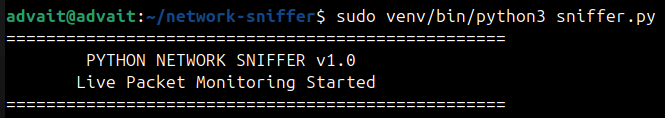
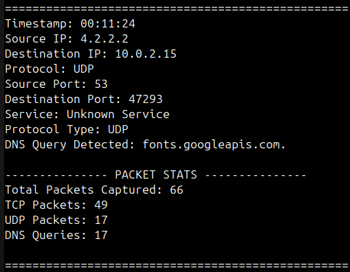
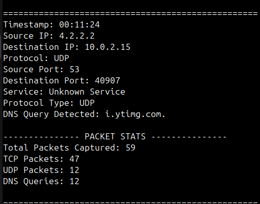
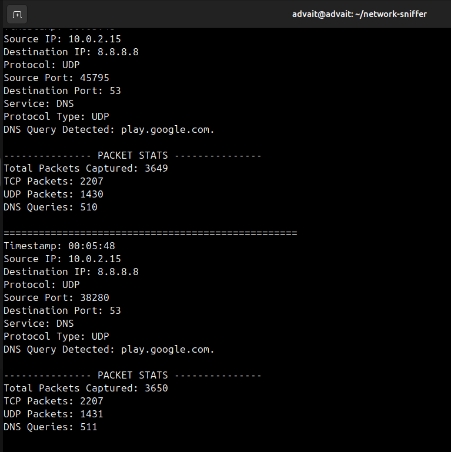
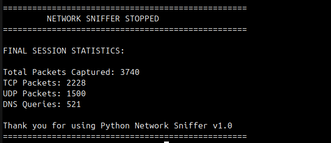

# Python Network Sniffer v1.0

A beginner-friendly network sniffer built using **Python + Scapy** to explore packet analysis, DNS monitoring, protocol inspection, and networking fundamentals through real-time traffic capture.

---

## 🚀 Features

* Live Packet Sniffing
* TCP / UDP Protocol Detection
* DNS Query Detection
* Service Identification
* Real-time Packet Statistics
* Timestamp Logging
* Startup Banner
* Graceful Ctrl+C Handling
* Final Session Statistics
* Protocol Dictionary Mapping

---

## 🧠 Concepts Used

* Packet Sniffing
* Network Interfaces
* TCP vs UDP
* Protocol Layers
* DNS Traffic Analysis
* Raw Sockets
* Packet Parsing
* Exception Handling
* Traffic Monitoring
* Real-time Statistics

---

## 📸 Screenshots

### 🔹 Startup Banner



---

### 🔹 DNS Detection



---

### 🔹 Live Traffic Analysis



---

### 🔹 Packet Statistics



---

### 🔹 Final Session Summary



---

## ⚙️ How It Works

1. Listens on a selected network interface
2. Captures packets using Scapy
3. Extracts IP layer information
4. Detects TCP / UDP packets
5. Identifies ports and services
6. Detects DNS queries
7. Tracks packet statistics in real-time
8. Displays final session summary on exit

---

## 🛠 Tech Stack

* Python
* Scapy
* Linux
* Virtual Environments
* Networking Fundamentals

---

## ▶ Usage

Install dependency:

```bash
pip install scapy
```

Activate virtual environment:

```bash
source venv/bin/activate
```

Run:

```bash
sudo venv/bin/python3 sniffer.py
```

---

## ⚠ Limitations

* Linux-focused implementation
* Captures only selected interface traffic
* Does not decrypt HTTPS traffic
* Requires elevated permissions
* High traffic may generate very large output

---

## 🔮 Future Improvements

* Packet filtering options
* Traffic export to file
* GUI version
* Better protocol detection
* Threading optimization (v2.0)
* Protocol statistics dashboard

---

## ⚠ Ethical Note

Use this tool only on systems and networks you own or are authorized to monitor.

---

## 👨‍💻 Author

Advait Pathak
